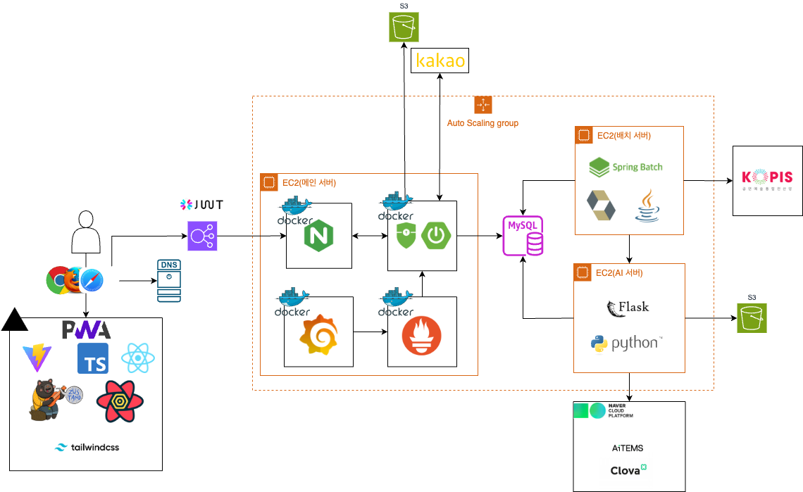
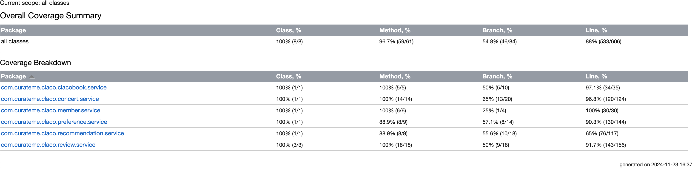
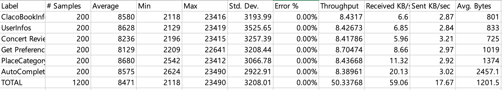
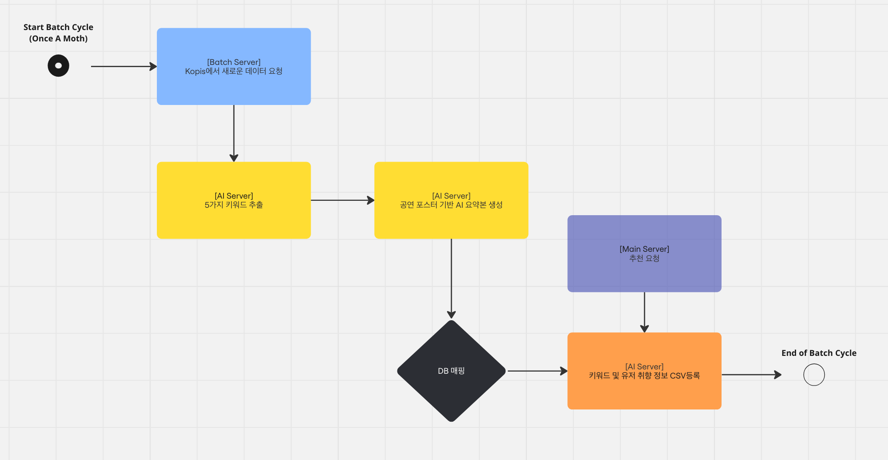
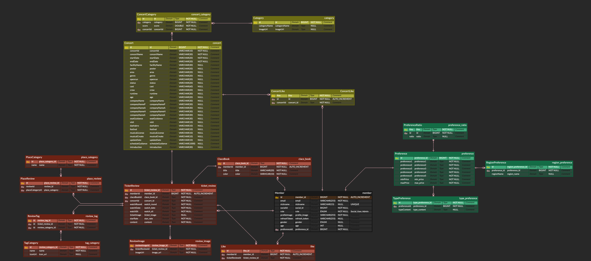
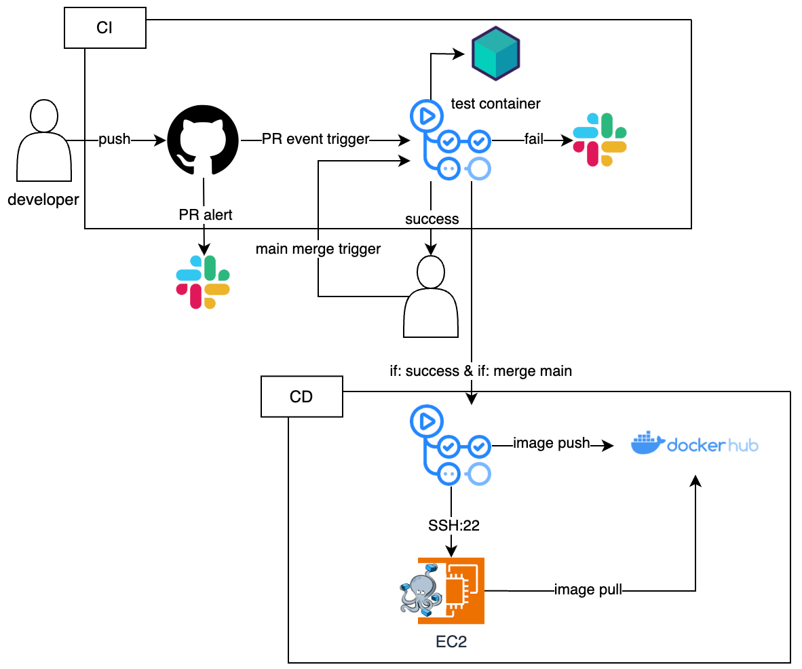

# 사용자 맞춤 클래식 공연 큐레이션 서비스 Claco

## 📱 서비스 소개
- 클래식 공연 감상의 길잡이가 되는 서비스를 제공함으로써 클래식 공연 문화를 더 즐겁게 향유할 수 있도록 합니다.
- 사용자의 취향에 맞는 공연을 추천해주고, 티켓을 만들어 추억을 간직하고, 공유합니다.

### 📆 개발 기간 및 인원
- ***2024.10.05 ~ 2024.11.24***
- ```Frontend```: 2명
- ```Backend```: 2명

## 🧑‍💻 R&R
|                                                           Profile                                                           |                  Name                   |                                               Role                                               |
|:---------------------------------------------------------------------------------------------------------------------------:|:---------------------------------------:|:------------------------------------------------------------------------------------------------:|
|  <a href="https://github.com/kimzini"></a>  |       김진희<br> **kimzini** <br> FE       |
|  <a href="https://github.com/dvp-tae"></a>  |      성태현 <br> **dvp-tae** <br> FE       |
|  <a href="https://github.com/devkeon"></a>  | \<개발 리드><br>이건 <br> **devkeon** <br> BE | 아키텍처 설계, ERD 설계, 메인 서버 인프라 및 CI/CD 구축, <br> 인증/인가, 모니터링 시스템 구축, 티켓/리뷰 기능,<br> 클라코북 기능, 회원 관련 기능  |
| <a href="https://github.com/anselmo228"></a> |      정희찬 <br> **anselmo** <br> BE       | ERD 설계, AI 및 배치 서버 인프라 및 CI/CD 구축, <br> 추천 AI 모델 구현, 배치 기능(데이터 로드) 구축, <br> 공연 기능, 공연 및 티켓 추천 기능 |


## 🏛️ 아키텍처


### PWA
- pwa 사용 설명

### 보안 고려 사항
- JWT를 활용한 인증/인가
  - SSL 보안 계층을 활용한 토큰 암호화 (HTTPS, ALB 설치)
  - CSRF / XSS 공격에 대비한 토큰 저장 분리 (Local storage, HTTP-only Cookie)
- Nginx를 활용한 actuator와 같은 민감 정보 deny
- Spring Security를 활용한 철저한 Auth 검사 및 uri 접근 조정
- Kakao OAuth2.0을 활용한 인증/인가 기능 간편화
- docker 네트워크를 활용하여 spring 서버나, prometheus같은 인스턴스 포트 매핑x (Endpoint 단일화)

### 추천 시스템 로직

- Collaborative Filtering & Cosine Similarity 기반 추천시스템
  1. 각 Concert는 AI가 추출해준 키워드 값에 대해 0 ~ 1 사이의 값을 가짐
  2. 유저도 마찬가지로 온보딩에서 등록한 취향 정보로 부터 모든 키워드 값에 대해 0 ~ 1사이 값을 가짐
  3. Concerts, Users CSV파일을 통해서 Cosine Similarity와 Collaborative Filtering을 통한 유사도 계산 후 추천 진행

### 메인 서버
- 서비스의 주요 로직을 처리하는 서버
- Grafana와 Prometheus에 기반한 모니터링 시스템 구축
- Nginx를 통한 리버스 프록시 설정

### AI 서버

- 공연 성격 분석이나, 유저 성격 분석, OCR을 처리하는 서버
- OCR 및 공연 성격 정보 추출은 NCP의 AI 서비스를 활용
- 추천 시스템의 경우 직접 Collaborative Filtering Model 구현

### 배치 서버

- KOPIS 시스템으로부터 공연 정보를 주기적으로 업데이트하는 서버(한달에 1번)
- KOPIS에서 데이터를 받아올때마다 AI서버에 학습 요청

# ⭐️ Frontend

#### 배포 URL https://claco-client.vercel.app/
* * *

## 💻 Technology
*  
*  
*  
*   


## 🧸 기술 스택 선정 이유

| 기술 스택 | 설명 |
|-----------|------|
| React | React는 가장 핵심 요소인 Virtual Dom을 이용하여 불필요한 화면 갱신을 최소화합니다. 이를 통해, 성능 향상을 시킬 수 있으며 빠른 렌더링을 지원합니다. React는 컴포넌트 기반 아키텍처를 채택하고 있으며, UI 요소들을 컴포넌트로 분리하여 개발하고 조합하는 방식으로 구성할 수 있습니다. 따라서, 컴포넌트의 재사용성을 용이하게 하며, 코드 수정 및 유지·보수에 효율적이기에 React를 사용하게 되었습니다. |
| TypeScript | TypeScript는 정적 타입 언어로, 코드를 더 안정적으로 만들고 개발자 사이의 협업을 용이하게 해줍니다. 생산성접근파일 단계에서 에러를 발견하여 런타임 오류를 방지하며, 코드 힌트와 자동 완성을 제공하여 개발 생산성을 높여주는 장점이 있어 TypeScript를 선정하게 되었습니다. |
| Zustand | 간결성과 유연성간결하고 직관적인 보일러플레이트 및 개발 방식을 제공합니다. 불필요한 렌더링 최소화상태가 변경될 때만 컴포넌트를 렌더링하므로 불필요한 렌더링을 최소화할 수 있어 성능 향상에 도움이 됩니다. |
| Yarn | 높은 속도, 안정성 및 보안성Yarn은 JavaScript 패키지 매니저로, 빠른 속도 및 높은 신뢰성과 보안성을 제공하여 효율적인 프로젝트 관리가 가능합니다. |
| Tanstack-Query | 효율적인 Data Fetching 및 관리데이터 캐싱 등의 기능을 존재하여 불필요한 데이터 요청을 줄일 수 있습니다. |
| TailwindCSS | 개발의 편의성 HTML과 CSS 파일을 별도로 개발 및 관리할 필요가 없기 때문에 개발하기에 편리하고, 팀핑하는 각 태그의 클래스명을 고민할 시간을 절약할 수 있어 빠른 개발이 가능합니다. |
| Vercel | 간편한 배포 자동화 가능하여에 푸시할 때마다 자동 배포하는 방식으로 간편하게 웹사이트를 배포할 수 있습니다. |

## 🗂️ Naming Rules
* 폴더명 - `PascalCase`
* 파일명 - `PascalCase`
* 타입, 유틸함수 등 - `camelCase`
* 상수 - `UpperCase`

## 📄 Commit Convension
커밋 메시지는 `태그: 커밋 메시지` 형식으로 작성 (ex. git commit -m "feat: 카카오 로그인 기능 구현")

📌Type

| 태그명 | commit 규칙 |
|----------|--------------|
| 🔗 feat | 새로운 기능 개발 |
| 🛠 fix | UI,UX 및 코드 수정 |
| 🎨 style | CSS 스타일링 및 퍼블리싱 작업 |
| 📄 docs | 문서 작업(REANME.md 등) |
| 📘 test | 배포 테스트, QA 테스팅 관련 |
| 🧰 refactor | 코드 리팩토링 |
| 🔧 rename | 폴더 혹은 파일명 변경 |
| ✂️ remove | 파일 삭제 |

## 🍀 Issue Template
* `기능 개발 관련 Issue Template`
  ### 이슈 설명☀️
  이슈에 관한 설명

  ### TO-DO📒
  - [ ] 할 일 1

  ### 기타🍀

* `버그 수정 관련 Issue Template`
  ### 에러 설명🚦
  무슨 에러인지 설명!

  ### 환경⚙️
  특정 기기에서만 발생하는 에러라면 디바이스 종류, 브라우저 종류 등!

  ### 재현 방법🧿
  어떻게 재현하는지 설명!

  ### 에러 화면📸
  스크린샷 or GIF 등..

## 🍀 Pull Request Template
* 관련 이슈
* 기존 코드에 영향을 미치는 작업 사항
* 기존 코드에 영향을 미치지 않는 작업 사항
* 작업 내용 스크린 샷
* 리뷰어에게 공유할 내용
* 추후 작업할 내용
* main (develop) 브랜치 pull 여부 확인

## 🌊 Git Flow
| 브랜치 명 | 역할 |
|----------|--------------|
| main | 최종 배포될 서비스의 브랜치 |
| develop | 개발 브랜치, 해당 브랜치에서 분기를 파 작업 후 merge |
| feature | 기능 개발 브랜치 |
| hotfix | main 브랜치 배포 후 긴급 수정 사항 발생 시 사용하는 브랜치 |


# 🔥 Backend

## 💻 개발 환경
> Language: ```Java 17``` <br>
> Framework: ```Spring Boot 3.3.4``` <br>
> Database: ```MySQL 8.x``` <br>
> ORM: ```JPA(Hibernate)``` <br>
> CI/CD: ```Github Actions``` <br>
> Cloud Platform: ```AWS(EC2, ALB, ACM), GCP(SQL)``` <br>
> Test DB: ```testcontainer```

## ⚙️ 개발 프로세스
- ```TDD (테스트 주도 개발)``` : 구문 커버지리 (Statement coverage) 기준 80%를 목표로 수행 
- ```Agile (애자일 프로세스)``` : 1주 단위 스프린트 수행
- ```Github Flow 전략``` : 초기 개발 과정에서 불필요한 브랜치 관리를 피하고, 빠른 배포를 위한 전략 선택
- ```CI/CD 파이프라인을 통한 배포 자동화``` : 서비스 개발이 50% 완료된 시점에서 구축하여 배포 자동화

## 💫 TDD 결과
- Service는 단위 테스트, Repository는 통합 테스트 진행
- ```testcontainer```를 활용하여 데이터베이스 멱등성 보장
- 테스트 코드 커버리지 측정 툴: ```IntelliJ``` <br>


- summary
  - statement coverage 기준: 88%
  - branch coverage: 54.8%
  - class coverage: 100%
  - method coverage: 96.7%

## 💫 부하 테스트 결과
- 사용 인스턴스 유형: ```t2.large (ram 8GB)```
- 부하 테스트 측정 툴: ```Jmeter```


- summary
  - 도메인별 주요 api 평균 50.3 Throughput


## 🔄 FlowChart of AI & Batch Server


## 📁 ERD


- 카테고리에서 연관 관계 설정을 통해 관계형 데이터베이스 활용
- AI 서비스 학습을 위한 soft delete 활용

## 🛠️ CI/CD pipeline

1. PR 이벤트 발생 시 CI 실행 (테스트 포함)
2. approve 및 CI 성공 시 merge 가능 
3. merge 이벤트 발생 시 CI 스크립트 수행 
4. CI 스크립트 성공 시 CD 스크립트 수행
5. Docker 이미지 docker hub에 push 
6. SSH로 AWS EC2 연결
7. docker hub에서 이미지 pull
8. dokcer-compose를 활용해 서비스 실행 및 도커 네트워크 구축
